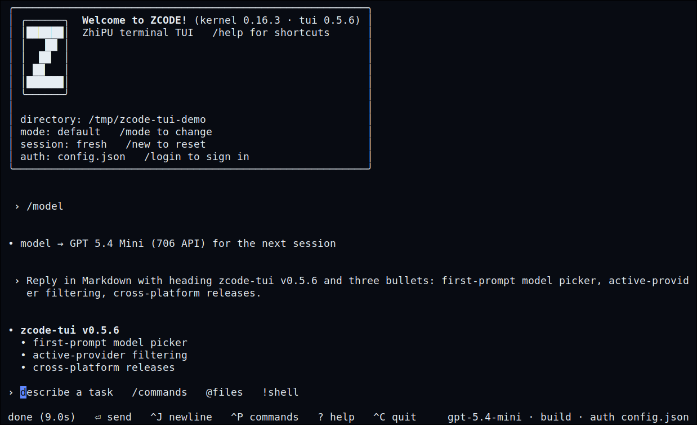

# zcode-tui

[Chinese](README.md) | [English](README.en.md) | [Releases](https://github.com/xhls008/zcode-tui/releases) | [Design](docs/2026-07-04-design.md)



> **Unofficial notice**: `zcode-tui` is not an official ZCode / Zhipu project
> and is not endorsed by ZCode or Zhipu. It is a community/personal Linux
> terminal fallback for the TUI experience currently missing from the official
> package.

`zcode-tui` is a Rust terminal-first fallback TUI for ZCode on Linux. It exists
for the gap where the official Linux package exposes a `tui` command, but does
not ship the terminal UI runtime (`@zcode/tui`).

It does not pretend to be an official implementation. It is a practical
terminal shell around the official ZCode CLI path: normal prompts go
through `zcode --prompt`, while slash commands, MCP config, shell escapes,
session selection, streaming output, command palette, and editor workflows are
handled locally.

## Theme

The premise is simple: if the official Linux package does not provide a usable
terminal interface, build one.

The project is designed for SSH, tmux, headless servers, and keyboard-first
workflows. It does not try to recreate the desktop application. It focuses on
the part Linux terminal users need immediately: a responsive TUI that starts
fast, streams output, keeps session state visible, and can be installed without
a desktop environment.

## Features

The interaction model is influenced by Claude Code, Codex CLI, Gemini CLI,
OpenCode, and Crush. See [the research notes](docs/references/tui-research-2026-07.md)
for details.

**Visuals and rendering**

- Codex-like transcript layout: borderless scrollback, user message bands,
  assistant output as flat markdown, and a compact footer.
- Zhipu-inspired cool gray theme with GLM-blue accents.
- Markdown rendering via `pulldown-cmark`: headings, emphasis, inline code,
  fenced code blocks, lists, quotes, rules, and display-width aligned tables.
- Syntax highlighting for fenced code blocks via `syntect`; `diff` fences and
  `/diff` output are colored by line role.
- Startup banner with kernel/TUI versions, cwd, mode, session, and auth status.
- Optional official update check using the same Linux update feed as the
  desktop app.

**True streaming (default on)**

- Prompts run through the kernel's `zcode app-server` protocol and the answer
  streams into the transcript token by token — single-turn Q&A included.
- Any failure (spawn, handshake timeout, schema mismatch, disconnect)
  permanently and seamlessly downgrades the process to the classic
  `--prompt` path; set `ZCODE_TUI_APP_SERVER=0` to force the classic path.
- Tool permission approval: gated side-effect tools (Write in build mode,
  plan approval in plan mode) raise an approval overlay (arrows + Enter to
  answer, Esc to decline) instead of hanging; approved tools continue within
  the same turn.
- Session controls on the live session: `/model` picker, `/think` thought
  level, `/compact` in-place context compaction; `/mode` and Shift+Tab apply
  immediately via `session/setMode`.
- Steering: plain text typed while a turn is streaming is injected into that
  turn (`session/steer`) instead of being queued.
- `/usage [7d|30d]` shows session and period token usage; `/update`
  self-updates the kernel from the official feed (sha512-verified).
- `@file` mentions become `session/send` attachments (image/file kinds,
  `localPath`-based), so the model reads them on the streaming path too.
- Project `.mcp.json` and user-level MCP config are passed to
  `session/create`/`resume` as `mcpServers` — the kernel does not read
  project `.mcp.json` on its own, so this is what makes MCP servers work in
  streaming sessions.
- Turn comfort: a terminal bell after >30s turns (`notify = off` disables),
  a `N file(s) changed · /diff to review` note when a turn wrote files, and
  the current model + mode in the footer (e.g. `glm-5.1 · build`).

**Sessions**

- Multi-turn continuity: after the first successful prompt, later prompts
  reuse the live streaming session (classic path: `--continue`).
- `/new`, `/resume [sess_id]`, `/mode`, and Shift+Tab mode cycling.
- `/sessions` picker for recent kernel sessions, sorted with current-directory
  sessions first; streaming resumes go through `session/resume` with the
  runtime-model fix (bare resumes used to fail their first send).
- After a resume, the last few exchanges replay as dim compact lines so the
  restored context is visible.
- Discarded live sessions (`/new`, clean exit) get a best-effort
  `session/close`.

**Interaction**

- Rust + Ratatui + Crossterm, shipped as a single static Linux binary in
  GitHub Releases.
- CJK-aware wrapping and cursor placement.
- Non-blocking streaming jobs for prompts, shell commands, and diffs.
- Esc/Ctrl+C cancellation with process-group kill on Unix.
- Busy input queueing.
- Live slash-command suggestions and `@file` completion.
- File mentions are translated into `--attach` after canonicalization, rejecting
  path traversal and symlink escapes.
- Persistent prompt history from the ZCode kernel database, plus Ctrl+R reverse
  search.
- Mouse wheel scrollback, optional with `ZCODE_TUI_NO_MOUSE=1`.
- Long output folding via Ctrl+O.
- Bracketed paste support.
- Ctrl+P command palette, Ctrl+X leader shortcuts, Ctrl+G external editor.
- `/copy` (or Ctrl+X then y) copies the last assistant reply to the system
  clipboard via OSC52 — works over SSH; in tmux enable
  `set -g set-clipboard on`.

**Live progress**

- While a prompt is running, `zcode-tui` can read the ZCode kernel SQLite
  database in a read-only way and render live tool progress as compact status
  chips.
- If the database schema is missing or unsupported, this feature degrades
  silently and normal streaming still works.
- JSON prompt results are parsed when available; plain text remains supported.

**Auth**

- `/auth` distinguishes complete kernel configuration from partial env-key or
  credential-file setups.
- The unauthenticated startup screen gives browserless login paths for headless
  machines.
- `/login` runs `zcode login`; on headless machines it adds `--no-browser` so
  the OAuth URL is visible in the terminal.
- `/logout` runs `zcode logout`.

**MCP config**

- Project scope `.mcp.json` and user scope `~/.config/zcode/mcp.json`.
- stdio, http, and sse transports.
- `/mcp add`, `/mcp add-json`, `/mcp get`, `/mcp enable`, `/mcp disable`,
  `/mcp remove`.
- Runtime commands such as `/mcp status` are forwarded to ZCode.

## Install

### Option 1: Download the release binary

Recommended for SSH servers and machines without a Rust toolchain.

```bash
mkdir -p ~/.local/bin
curl -fL -o ~/.local/bin/zcode-tui \
  https://github.com/xhls008/zcode-tui/releases/latest/download/zcode-tui-x86_64-unknown-linux-musl
chmod +x ~/.local/bin/zcode-tui
```

If you also want the `zcode` wrapper:

```bash
curl -fLO https://github.com/xhls008/zcode-tui/releases/latest/download/install.sh
bash install.sh --no-build
```

### Option 2: Build from source

```bash
./install.sh
```

The installer builds the release binary, installs it to
`~/.local/bin/zcode-tui`, and installs a managed `~/.local/bin/zcode` wrapper.
The managed wrapper enables app-server true streaming for the fallback TUI by
default; use `ZCODE_TUI_APP_SERVER=0 zcode` to force the classic `--prompt`
path.

Manual build:

```bash
cargo build --release
./target/release/zcode-tui
```

Or point an existing wrapper at a custom fallback binary:

```bash
export ZCODE_FALLBACK_TUI="$PWD/target/release/zcode-tui"
zcode tui
```

## SSH and Headless Use

This is the primary use case. The TUI itself is a pure terminal application and
works over SSH and tmux. The only tricky part is bootstrapping the official
ZCode kernel.

1. Get the kernel without installing system-wide:

   ```bash
   dpkg-deb -x ZCode-<version>.deb ~/.local/opt/zcode/<version>/
   ```

2. Run the kernel. The wrapper probes `$ZCODE_APP`, `/opt/ZCode`, and
   `~/.local/opt/zcode/*/opt/ZCode`. It prefers Electron's embedded Node when
   possible, then falls back to system Node. The kernel requires Node >= 22.5
   because it uses `node:sqlite`.

3. Log in. In headless environments, use one of:

   ```bash
   zcode login bigmodel-coding-plan-api-key <key>
   zcode login zai-coding-plan-api-key <key>
   zcode login --no-browser
   ```

   Or copy both files from a logged-in machine:

   ```text
   ~/.zcode/cli/config.json
   ~/.zcode/v2/credentials.json
   ```

## Common Commands

```text
text                         send a prompt through zcode --prompt
@<path>                      mention a file and auto-attach it
! <cmd>                      run a local shell command
/goal <text>                 forward goal handling to ZCode
/skill <name> <task>         force a ZCode skill
/skills [list]               run zcode skills list
/login                       interactive login
/logout                      logout
/auth                        show local auth status
/status                      show session, auth, and MCP overview
/sessions                    open recent session picker
/mcp list                    list project and user MCP servers
/mcp add <name> <cmd> [args] add stdio MCP server
/mcp add --transport http|sse <name> <url>
/mcp add-json <name> <json>
/mcp get <name>
/mcp enable|disable <name>
/mcp remove <name>
/mode [build|edit|plan|yolo]
/model
/think
/compact
/usage [7d|30d]
/update
/copy
/resume [sess_id]
/new
/diff [args]
/ide [path]
/editor
/clear
/exit
```

## Configuration

Config file:

```text
~/.config/zcode-tui/config
```

Line format:

```text
# Theme token overrides. The default theme is GLM blue plus cool terminal gray.
# Tokens: accent accent_dim text dim good bad frame code_bg band_bg brand brand_dim
accent = #6088ff

# Disable mouse capture.
mouse = off

# Disable the >30s turn-complete terminal bell.
notify = off
```

`NO_COLOR` and `--no-color` take precedence over theme colors.

Useful environment variables:

```text
ZCODE_TUI_ZCODE_BIN
ZCODE_TUI_LOGIN_CMD
ZCODE_TUI_LOGOUT_CMD
ZCODE_TUI_IDE_CMD
ZCODE_TUI_NO_UPDATE_CHECK
ZCODE_TUI_APP_SERVER        (set 0/off/false to force the classic --prompt path)
ZCODE_TUI_LOG               (file path: append-only protocol debug log;
                             outbound entries are method names only — request
                             params, runtimeModel, and apiKey never touch disk)
ZCODE_TUI_NO_MOUSE
ZCODE_TUI_SKYLINE
ZCODE_TUI_CONFIG
ZCODE_APP
ZCODE_FALLBACK_TUI
ZCODE_FORCE_SYSTEM_NODE
```

## Design and References

- [Design document](docs/2026-07-04-design.md)
- [TUI research notes](docs/references/tui-research-2026-07.md)
- [Agent TUI habits](docs/references/agent-tui-habits.md)
- [GitHub Releases](https://github.com/xhls008/zcode-tui/releases)

## Limitations

This fallback does not recreate the missing official `@zcode/tui` package, and
it does not have access to any private desktop-app runtime model. It does one
plain useful job: read terminal input, route local slash commands, call the
official CLI path, and render output.

## Background

The official Linux package currently makes terminal users do extra work: the CLI
help lists `tui`, but `zcode tui` can fail because the package does not include
`@zcode/tui`.

That gap is the reason this project exists.

The Chinese README keeps the sharper roast images and wording:
[README.md](README.md#背景与吐槽).

## Development

```bash
cargo fmt
cargo test
cargo clippy --all-targets --all-features
```

## License

MIT
