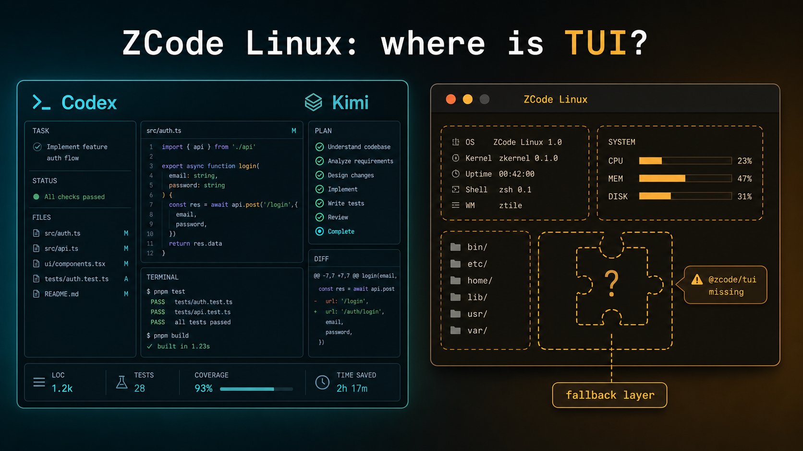

# zcode-tui



ZCode Linux beta has a `tui` command in the CLI help, but the package shipped here does not include `@zcode/tui`. So `zcode tui` says the chair is there, then you sit down and hit the floor.

Kimi has a terminal UI. Codex has a terminal UI. ZCode claims to be serious about coding, then Linux users get a missing runtime package. This project is a Rust fallback layer for that gap. Is this still "国产大模型 top 1" energy? The README cannot decide, so it ships a workaround.

This is not the official ZCode TUI. It is a practical terminal wrapper that talks to the official `zcode --prompt` path and handles the slash commands that are annoying to lose.

## Features

- Rust binary, no Python runtime.
- Ratatui + Crossterm interface with a proper multi-panel layout.
- Entry screen carries the `智谱` brand mark with `@zcode`.
- Conversation panel, command/control panel, prompt box, and status bar.
- Help modal via `/help`.
- Input history with Up/Down.
- Scrollback with PgUp/PgDn, Home, and End.
- Common shortcuts: Ctrl+L clear, Ctrl+U clear input, Ctrl+Q quit.
- Starts when `zcode tui` falls through because `@zcode/tui` is missing.
- Sends normal text through `zcode --prompt`.
- Supports `/goal ...` and `/goal replace ...` by forwarding them to ZCode.
- Supports `/skill <name> <task>` by forwarding it to ZCode.
- Supports `/skills [list]` by calling `zcode skills list`.
- Supports local MCP configuration:
  - `/mcp list`
  - `/mcp config`
  - `/mcp add <name> <command> [args...]`
  - `/mcp remove <name>`
- Forwards runtime MCP session commands like `/mcp status` to ZCode.

## Install

Build the binary:

```bash
cargo build --release
```

Run it directly:

```bash
./target/release/zcode-tui
```

Or point the local ZCode wrapper at it:

```bash
export ZCODE_FALLBACK_TUI="$PWD/target/release/zcode-tui"
zcode tui
```

On this machine the wrapper at `~/.local/bin/zcode` is patched to try official TUI first, then fall back to this binary only when the Linux package reports:

```text
Cannot find package '@zcode/tui'
```

## Commands

```text
text                         send a prompt with zcode --prompt
/goal <text>                 forward to ZCode goal handling
/goal replace <text>         replace current goal through ZCode
/skill <name> <task>         force a ZCode skill for a prompt
/skills [list]               list ZCode skills through zcode skills list
/mcp list                    list local .mcp.json servers
/mcp config                  print local .mcp.json path
/mcp add <name> <cmd> [args] add/update an MCP server in .mcp.json
/mcp remove <name>           remove an MCP server from .mcp.json
/mcp status                  forward to ZCode as /mcp status
/clear                       clear this screen
/exit                        quit
```

## Limits

This fallback does not recreate ZCode's missing `@zcode/tui` package. It does not provide the same internal live session model as the official TUI would. It is deliberately boring: read input, route slash commands, call official ZCode command-line paths, show output.

That boring layer is enough to stop Linux users from being blocked by a missing package.

## Development

```bash
cargo fmt
cargo test
cargo clippy --all-targets --all-features
```

## License

MIT
