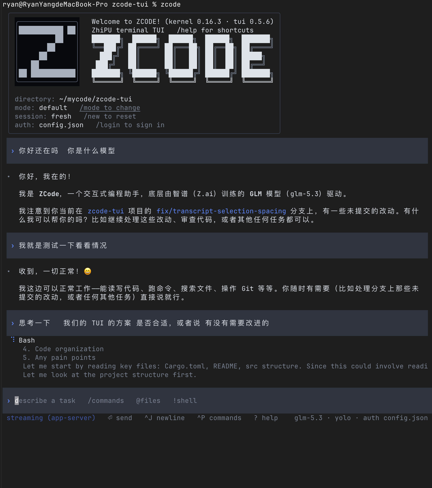

# zcode-tui

[中文](README.md) | [English](README.en.md) | [Releases](https://github.com/xhls008/zcode-tui/releases) | [Design](docs/2026-07-04-design.md)



> v0.6.0 界面实机截图：ZCode CLI kernel 0.16.3，macOS。展示自适应 ASCII
> 品牌面板、终端原生 scrollback、app-server 阶段追加，以及只读的父 Agent /
> Subagent / Background Inspector；当前源码另已实测适配 ZCode Linux 3.8.1。

> **非官方声明**：`zcode-tui` 不是 ZCode / 智谱官方项目，也未获得官方背书。
> 它是社区/个人维护的 Linux 终端 fallback，用来补齐官方包当前缺失的 TUI 体验。

`zcode-tui` 是一个 **Rust 写的 ZCode 终端 TUI fallback**，专门兜住官方 Linux
包缺少 `@zcode/tui` 的尴尬空洞。它面向 SSH、tmux、无桌面服务器和纯键盘
工作流：普通输入优先走官方 `zcode app-server`，不可用时自动回退到
`zcode --prompt`；常用 slash 命令、MCP 配置、shell escape、命令面板、会话
选择、阶段流式输出和编辑器工作流在本地补齐。

它不伪装成官方实现，只是一个实用的终端壳。

## 当前验证基线

| 组件 | 当前版本 / 状态 |
|---|---|
| ZCode Linux x64 桌面包 | **3.8.1**（官方 feed） |
| 官方 CLI kernel | **0.16.3**（随 ZCode 3.8.1，版本未变） |
| zcode-tui | **0.6.1** |
| 协议兼容 | 3.8.1/3.7.7/3.7.6：runtime preferences 握手 + legacy 正文流 + V4 控制；3.5.3：legacy + V4；3.3.6：legacy 控制路径 |
| 当前源码验证 | Rust 测试 140/140；Clippy 零告警；原生 release 构建通过；3.8.1 app-server 握手和 TUI 启停正常 |

官方 x64 feed 若出现新版本，启动提示和 `/update` 会继续按 SHA-512 校验后更新；
协议变化仍需重新做 app-server/V4 实机验证，不能只根据 CLI 版本号假定兼容。

## 项目主题

官方 Linux 包把 `tui` 命令写进 help，却没有把 terminal TUI runtime 一起交付。
这个项目的主题很简单：**官方不干，那就自己造**。

它不追求复刻桌面端，也不等一个不知道何时补齐的 `@zcode/tui`。目标是给 SSH、
tmux、无桌面服务器和纯键盘工作流一个能立即使用的终端界面：少一点发布会式
想象，多一点能跑、能补全、能流式输出、能接住日常工作的工程实现。

## 功能

设计参考了 Claude Code、Codex CLI、Gemini CLI、OpenCode、Crush 的使用习惯，
调研记录见 `docs/references/tui-research-2026-07.md`。

**视觉与渲染**

- Codex 风布局：无边框流式 transcript，用户消息使用背景横条和 `›` 提示符，
  助手回复 `•` 开头平铺，会话信息横幅进 transcript，
  底部一行 dim 快捷键提示（运行任务时变 spinner 工作行）。
- 智谱风配色：GLM 蓝单一强调色 + 冷灰中性色阶，行内代码蓝色文字、
  引用绿色，语义绿/红只用于 diff 与错误；
  `--no-color` 或 `NO_COLOR` 时退化为无色。
- **语法高亮**：围栏代码块按语言用 syntect 着色（Codex 同款方案，
  base16-ocean 主题）+ dim 行号 gutter；` ```diff ` 围栏按
  +绿/−红/@@蓝 渲染（+/- 是 diff 专属语义，普通代码块只有行号）。
- **启动欢迎框**：圆角信息框内同时保留最初的 Z 图标与官方 SVG 字标重制的
  黑白纯文本 ZCODE Logo，显示内核/TUI 版本、目录、mode、auth 及对应提示；
  终端宽度不足时自动隐藏大字标，不缩放成模糊点阵。
- **官方更新检测**：启动时后台读取 `/opt/ZCode` 的 electron-updater
  配置并拉取官方 `latest-linux.yml`（与桌面端同一发布渠道），发现新版
  时显示官方 ZCODE 纯文本字标；SVG 保留为品牌参考源码，并显示 Tip 提示
  （含 changelog 链接与 deb 直链）；`ZCODE_TUI_NO_UPDATE_CHECK=1` 关闭。
- **Markdown 渲染**：助手回复按 markdown 渲染——标题、粗斜体、行内代码、
  围栏代码块、列表、引用、**表格（按显示宽度对齐列）**、分隔线
  （pulldown-cmark，Codex CLI 同款）。
- **`/diff [args]`**：git diff 语法着色（+绿 −红 @@蓝 文件头加粗），
  如 `/diff --staged`、`/diff HEAD~1`。
- **工具调用可视化**：当 zcode 以 `--json` 输出 JSONL 事件时，
  `tool_use`/`tool_result` 渲染为紧凑 chip（`⚙ bash {...}` / `↳ 结果`），
  文本事件正常走 markdown；纯文本输出不受影响。

**会话**

- **多轮连续对话**：首条 prompt 成功后自动带 `--continue`，TUI 里的对话
  在内核会话中延续；`/new` 重开（上下文重置）、`/resume [sess_id]` 恢复
  最近或指定会话、`/mode` 或 `Shift+Tab` 切换权限模式
  （build/edit/plan/yolo），欢迎框实时显示会话状态。
- **`/sessions` 会话选择器**：浮层列出最近内核会话（标题/目录/相对时间，
  当前目录的排前），↑↓ 选择、Enter 接续、Esc 关闭。
- **resume 历史回放**：流式续接成功后，在 "resumed sess_…" 提示下用 dim
  紧凑行回放最近 ≤6 条对话（`›` 用户 / `·` 助手，每条 ~400 字符截断），
  接上话头不用翻旧账。
- **会话善后**：`/new` 丢弃活跃流式会话与 `/exit` 退出时尽力发
  `session/close`，不留悬挂会话（fire-and-forget，失败静默）。

**交互**

- Rust + Ratatui + Crossterm，单一静态二进制，毫秒级启动。
- CJK 感知：中文按 2 列宽度折行与定位光标，表格按显示宽度对齐。
- **非阻塞流式执行**：`zcode --prompt` 和 `! <cmd>` 的输出按行实时进 transcript，
  spinner 显示耗时，`Esc`/`Ctrl+C` 取消，忙时新输入自动排队。
- **实时进度**：prompt 运行期间只读轮询内核会话库（`~/.zcode/cli/db/db.sqlite`，
  内核边跑边写），工作区实时显示工具 chip（运行中 spinner → 完成 ✓ + 耗时 /
  失败 ✗）和最新 reasoning；仅运行时显示、结束即清场；schema 不识别或库缺失
  时整组自动降级。
- **Agent Inspector**：`/agents` 从官方 `session/subagents`、V4 状态和生命周期
  事件归并父 Agent、Subagent 与 Background 工作。支持 Agents/Background 分页、
  列表/详情、刷新与稳定选择；界面始终标明只读查看和 `input target: parent`。
  只有官方声明 `cancellable=true` 且带真实 `taskId` 的 Background 记录可用 `x`
  取消。ZCode 0.16.3 的非活跃 child transcript 只能经有状态 resume 读取，因此不
  自动恢复 child、不伪造定向消息，也不回退读取 SQLite；详情保留官方摘要和输出尾部。
- **上下文与 Token 状态栏**：输入框旁始终显示父会话的 `ctx 已用/窗口 (%)` 与
  累计 `tok`。Context 随 `state.updated` 持续更新，每轮完成后静默刷新
  `session/usage`；`/usage [7d|30d]` 在回答流式生成期间也可立即查询，不进入队列。
- **阶段流式（默认开启）**：接内核 `zcode app-server`
  协议（`session/create → subscribe → send`），助手正文经 `session/event`
  的 `text_delta` 累积；工具开始时冻结并追加前一段正文，工具完成时追加结果，
  回合完成时追加尾段。已经进入终端 scrollback 的行永不回写或重排。任一环节
  失败（起不动 /
  握手超时 / schema 不符 / 断连）→ 本进程永久无缝降级回 `--prompt` + 一条
  dim 提示，当前 prompt 用 `--prompt` 重试一次，用户永不卡死；需要经典
  `--prompt` 路径时设 `ZCODE_TUI_APP_SERVER=0`。ZCode 3.5.3 上会在 legacy
  正文流之上协商 `v4/conversation/subscribe`，仅把新版控制能力接到 V4；
  3.3.6 返回 Method not found 时继续使用既有 legacy 控制，不影响正文流。
  ZCode 3.7.6+ / CLI 0.16.3 建会话时新增的
  `session/requestRuntimePreferences` 反向请求会自动应答；不再等待 15 秒后
  错误降级到经典路径。
- **工具权限确认（app-server 路径）**：build 模式下有副作用的工具（写文件等）
  与 plan 模式的计划审批会弹**确认浮层**（↑↓ 选项 / Enter 应答 / Esc 拒绝），
  批准后工具同回合继续执行；plan 计划批准后自动切 build 并续跑。
  edit/plan/build 模式的权限门禁在流式路径上**真正生效**（不再是 headless
  一律 yolo）。
- **会话工具策略（ZCode 3.3.6）**：启动参数 `--allowed-tools`、
  `--disallowed-tools`/`--disallowedTools` 在经典路径继续传给 `--prompt`，
  流式路径则翻译成 `session/create`/`resume` 的
  `toolAllowlist[]`/`toolDenylist[]`，不会再被 app-server 静默忽略；
  `--permission-mode` 作为 `--mode` 的旧别名接入（`default` = `build`）。
- **会话控制（app-server 路径）**：`/model` 浮层切换模型、`/think` 循环思考
  级别、`/compact` 原地压缩上下文保住会话、`/mode`/Shift+Tab 即刻切换活跃
  会话的权限模式；**流式回合进行中直接输入文本＝转向（steer）当前回合**，
  不用取消重来。3.5.3 使用 V4 `setFollowupMode:guide` + `sendText`，并以随后
  frame 中 queue item 的 `delivery.admitted == guide` 才判成功；旧内核继续
  使用 `session/steer`。不再把本地“steering”提示误当成协议成功。
- **动态模型目录**：启动时通过 ZCode app-server 的 `workspace/readState` 获取
  内核目录，并把桌面端 `~/.zcode/v2/config.json` 的匹配模型元数据合并到 CLI
  当前 provider，再经 `workspace/updateProviderRegistry` 注册，因此可使用桌面端
  已提供但独立 CLI 目录尚未列出的 `GLM-5.3-Flash`。认证与 endpoint 始终取自
  `~/.zcode/cli/config.json`；凭据只在本机进程内存中交给同一 app-server，不写
  日志、不回写配置，也不由 TUI 直连供应商。公开模型元数据缓存到
  `~/.cache/zcode-tui/models.json`，app-server 暂时不可用时用于回退。`/model`
  在首次对话前可用，只展示当前 provider；选择结果以不含凭据的
  `{providerId, modelId}` 保存到 `~/.config/zcode-tui/model.json`，下次启动自动
  应用于新建或恢复的会话。
- **检查点回滚（app-server 路径）**：内核每次放行的工具写盘都会产生检查点；
  3.3.6 的 `/rewind` 浮层列出本会话检查点（含 latestCheckpoint），Enter
  先预览将还原/删除的文件，选 scope 后应用；3.5.3 则从 V4 conversation
  rows 选择稳定 `{rowId,entityId}`，调用 V4 preview 与
  `v4/command applyFileRewind`。两条路径都尊重 unsafe file 拒绝，绝不强刷
  会话外手工改动；3.5.3 尚未验证等价的对话 scope，因此只开放 workspace。
- **Browser Use（ZCode 3.5.3）**：`--browser-use headless` 与可选
  `--browser-executable <path>` 被显式解析。由于 strict app-server schema
  不接受 `browserUse`，这类 turn 明确路由到官方 `zcode --prompt`，界面提示
  该 turn 没有 token 流式/steer 控制；参数不会再在流式路径被静默忽略。
- **上下文水位**：prompt 通道用 `--json` 总结对象作为权威结果（response 走
  markdown 渲染，解析失败自动降级纯文本），状态栏常驻 `ctx 9k/200k (4%)`
  用量显示，≥80% 提示 `/compact` 或 `/new`。
- **实时补全菜单**：输入 `/` 即弹出建议（前缀 > 子串 > 子序列模糊匹配），
  上下键选择、`Tab`/`Enter` 接受、`Esc` 关闭。
- **`@文件` 提及**：输入 `@` 补全项目内路径（跳过 .git/target/node_modules）；
  提交时存在的 `@路径` 在经典路径翻译成 `--attach`，在流式路径翻译成
  `session/send` 的 `attachments[]`（图片扩展名走 image、其余按扩展名给
  mimeType，`localPath` 直引本机文件）——两条路径都能让模型读到文件。
- readline 式光标编辑：Left/Right、Home/End、`Ctrl+A/E`、`Ctrl+W`、Delete。
- 输入框按终端显示宽度自动换行（中文按双宽字符计算）；超过五行时输入视口
  自动跟随光标，不再把持续输入截断在右边缘。
- **持久输入历史**：启动时读入内核 `input_history`（内核记录每条 --prompt），
  Up/Down 跨进程可用；`Ctrl+R` 反向搜索（子串过滤、新→旧、Enter 取回）。
- 使用普通屏幕的 Ratatui inline viewport：完成的对话写入终端 scrollback，底部
  只重绘流式状态和输入框。应用不捕获鼠标，滚轮、普通拖选以及 macOS
  `Cmd+C` / Windows、Linux `Ctrl+Shift+C` 全部由系统终端原生处理；scrolling-region
  稀疏写入不会把行尾空格固化到历史中，窗口缩放时由终端正常重排。
- 对话按产生顺序持续追加：完成的用户、正文阶段、工具结果和助手尾段进入系统
  scrollback，底部只显示尚未完成的 thinking 状态与输入框；不固定轮数，也不按
  可用高度重新排列历史。
- **结构化工具摘要**：Agent 内部的 Read/Search/Bash/Edit/MCP 等调用只展示
  文件、查询、耗时和状态等有意义信息；失败保留有界的诊断尾部。
  `! command`、`/diff`、`/usage`、`/status` 和助手最终回答始终完整展示。
- **OSC52 复制**：`Ctrl+X` 后 `y` 或 `/copy` 把最后一条助手回复写进系统
  剪贴板（OSC52 直发终端，SSH 远程也能落到本地剪贴板；负载 ~100KB 截断）。
  tmux 里需 `set -g set-clipboard on`。
- **回合完成铃**：流式回合或经典 prompt 任务收尾且耗时 >30s 响一声终端铃
  （BEL），切走干别的也知道跑完了；配置 `notify = off` 关闭，取消不响。
- **文件变更小结**：流式回合里被门禁工具落盘会产生 checkpoint，收尾时
  显示 `N file(s) changed · /diff to review`，改没改文件一眼可知。
- **状态栏模型/模式**：footer 右侧常驻当前模型与权限模式
  （如 `glm-5.1 · build`，取内核状态推送；首推送前只显示模式）。
- bracketed paste：多行粘贴不会误触发提交。
- `Ctrl+P` 命令面板；OpenCode 风格 leader key：`Ctrl+X` 后接 `p/h/e/x/u/q`。
- `Ctrl+G` 或 `/editor` 调 `$VISUAL`/`$EDITOR` 编辑长 prompt；`Ctrl+J` 多行输入。
- Up/Down 输入历史；历史回看使用终端原生滚轮或系统 scrollback 快捷键。

**认证**

- `/auth` 三态检测：内核硬性要求 `~/.zcode/cli/config.json`（实测 0.15.0），
  以它为"已配置"的判据；只有 env key（`ZCODE_API_KEY` 链，打码显示）或凭证
  文件时如实显示"部分配置"并给出补齐命令，不再误报已登录。
- **未登录启动屏**：清华紫 ZCODE 字标（块体亮紫 + 描边暗紫阴影），底部
  鸟巢/长城/天坛轮廓线，列出三条免浏览器登录路径；`NO_COLOR` 全退化。
- `/login` 挂起 TUI，交互式执行 `zcode login`（Z.AI OAuth，可用
  `ZCODE_TUI_LOGIN_CMD` 覆盖）；无桌面环境（无 `DISPLAY`/`WAYLAND_DISPLAY`）
  自动附 `--no-browser`，OAuth URL 直接打印在终端。
- `/logout` 执行 `zcode logout`（可用 `ZCODE_TUI_LOGOUT_CMD` 覆盖）。
- 顶栏和状态栏常驻显示当前认证方式。

**MCP 配置**（`.mcp.json` 与 Claude Code 格式兼容）

- 两级 scope：项目 `.mcp.json` 和用户级 `~/.config/zcode/mcp.json`（`--scope user`）。
- **流式会话真生效**：内核自身不读项目 `.mcp.json`（实测 0.15.0）；TUI 在
  `session/create`/`resume` 时把两级配置翻译成协议的 `mcpServers[]` 传给
  内核（disabled 跳过、同名项目级优先），模型在会话内拿到
  `mcp__<name>__<tool>` 工具。
- stdio 与远程 server：`/mcp add --transport http|sse <name> <url>`。
- `/mcp add-json`、`/mcp get`、`/mcp enable`、`/mcp disable`（软开关，不删配置）。
- `/mcp status` 等运行态命令继续转发给 ZCode。

**路由**

- 普通文本通过 `zcode --prompt` 发送给 ZCode。
- `/goal ...`、`/goal replace ...`、`/skill <name> <task>` 转发给 ZCode。
- `/skills [list]` 调 `zcode skills list`；`/status` 显示会话/认证/MCP 概览。
- `! <cmd>` 本地 shell escape。
- 官方 `zcode tui` 因缺 `@zcode/tui` 失败时，可自动 fallback 到这个 TUI。

## 安装 / 更新

**方式一：下载 Release 二进制（SSH 服务器推荐，无需 Rust 工具链）**

每个版本都会发布 [GitHub Release](https://github.com/xhls008/zcode-tui/releases)，
附带 Linux x86_64、Windows x86_64、macOS Intel 和 macOS Apple Silicon
二进制及统一的 `SHA256SUMS`：

| 平台 | Release 文件 |
|---|---|
| Linux x86_64 | `zcode-tui-x86_64-unknown-linux-musl`（静态链接） |
| Windows x86_64 | `zcode-tui-x86_64-pc-windows-msvc.exe` |
| macOS Intel | `zcode-tui-x86_64-apple-darwin` |
| macOS Apple Silicon | `zcode-tui-aarch64-apple-darwin` |

Linux 安装：

```bash
mkdir -p ~/.local/bin
curl -fL -o ~/.local/bin/zcode-tui \
  https://github.com/xhls008/zcode-tui/releases/latest/download/zcode-tui-x86_64-unknown-linux-musl
chmod +x ~/.local/bin/zcode-tui
```

需要 `zcode` wrapper 的话，再取同一 Release 里的 `install.sh` 以 `--no-build`
模式生成（不需要 cargo）：

```bash
curl -fLO https://github.com/xhls008/zcode-tui/releases/latest/download/install.sh
bash install.sh --no-build
```

macOS 下载与当前机器架构对应的文件，保存为 `zcode-tui` 后执行
`chmod +x zcode-tui`。Windows 直接下载 `.exe`。两者都需要让可调用官方内核的
`zcode` 命令位于 `PATH`，或通过 `ZCODE_TUI_ZCODE_BIN` 指定；`install.sh` 及
内置 `/update` 仍只适用于 Linux。

> **macOS 授权与模型配置**：ZCode 3.8.1 / CLI 0.16.3 的官方
> `zcode login` OAuth 路径仍可能返回 `OAuth response is not valid JSON`；这是
> [上游问题](https://github.com/zai-org/feedback/issues/51)，不是本 TUI 能修复的
> 登录服务。建议使用 `zcode login zai-coding-plan-api-key <key>`（国际）或
> `zcode login bigmodel-coding-plan-api-key <key>`（国内）。桌面端登录信息位于
> `~/.zcode/v2/`，但 CLI 仍需要含明确 `provider/model` 的
> `~/.zcode/cli/config.json`；仅登录桌面端不会自动生成该 CLI 模型配置。

**方式二：从源码构建**

一条命令完成构建和安装（更新同样跑它）：

```bash
./install.sh
```

它会把 release 二进制装到 `~/.local/bin/zcode-tui`，并生成 `~/.local/bin/zcode`
wrapper（带管理标记，重复运行幂等；已存在的非托管 wrapper 会先备份）。托管
wrapper 默认沿用 fallback TUI 的 app-server 真流式；需要回到经典 `--prompt`
路径时可 `ZCODE_TUI_APP_SERVER=0 zcode`。
其他用法：

```bash
./install.sh --prefix /usr/local   # 装到别的前缀
./install.sh --no-wrapper          # 只装 zcode-tui 二进制
./install.sh --uninstall           # 卸载
```

也可以手动构建直接运行：

```bash
cargo build --release
./target/release/zcode-tui
```

或让 wrapper 指向自定义位置的 fallback：

```bash
export ZCODE_FALLBACK_TUI="$PWD/target/release/zcode-tui"
zcode tui
```

这台机器上的 `~/.local/bin/zcode` 是一个 wrapper，串起官方包和本项目：

- 官方 Linux 桌面包（`/opt/ZCode`，deb 来自 `cdn-zcode.z.ai`）内嵌了 headless CLI
  内核 `resources/glm/zcode.cjs`（`--prompt`、`--attach`、`login`、`skills` 等都在）。
- 内核需要 `node:sqlite`（Node ≥ 22.5），wrapper 优先用 Electron 自带的 Node
  （`ELECTRON_RUN_AS_NODE=1 /opt/ZCode/zcode`）运行它；Electron 起不动时
  （无桌面机器缺 GUI 库）自动回退到系统 Node（需 ≥ 22.5），
  `ZCODE_FORCE_SYSTEM_NODE=1` 可强制走系统 Node。
- `zcode tui` 或裸 `zcode` 前先探测 `@zcode/tui` 能否解析；官方 Linux 包
  报下面这个错误时，才 fallback 到本项目：

```text
Cannot find package '@zcode/tui'
```

首次使用前需要登录：`zcode login`（Z.AI OAuth），或在 TUI 里执行 `/login`。

## SSH / 无桌面环境

这是本项目的核心使用场景：在没有桌面的服务器上通过 SSH 直接用终端跟 ZCode
干活。TUI 本身是纯终端程序（无剪贴板、通知、浏览器依赖，ratatui + crossterm
在 SSH/tmux 里和 vim 一样工作），要打通的只有内核引导这一环：

1. **拿到内核**：无桌面机器不必安装 deb，解包即可（无需 root）：

   ```bash
   dpkg-deb -x ZCode-<ver>.deb ~/.local/opt/zcode/<ver>/
   ```

   wrapper 自动探测 `$ZCODE_APP` → `/opt/ZCode` →
   `~/.local/opt/zcode/*/opt/ZCode`；多个免 root 版本并存时按数字版本排序
   （`3.10` 高于 `3.9`），并把实际目录通过 `ZCODE_APP` 传给 fallback TUI，
   启动检查与 `/update` 因而对应正在运行的内核。

2. **运行内核**：极简服务器往往缺 Electron 加载所需的桌面库（libgtk-3、
   libnss3 等，即使 `ELECTRON_RUN_AS_NODE=1` 也要先过动态链接）。wrapper 会
   探测 Electron 能否启动，起不动时自动回退到系统 Node（需 ≥ 22.5，内核依赖
   `node:sqlite`）。两条路满足其一即可：装 Node ≥ 22.5，或
   `apt install libgtk-3-0t64 libnss3`（只装库，不需要桌面会话）。

3. **登录**：内核硬性要求 `~/.zcode/cli/config.json`（模型配置），只设
   `ZCODE_API_KEY` 环境变量是**不够**的（实测 0.15.0）。免浏览器的路，
   按推荐顺序：

   - Coding Plan API key 一条命令配置：
     `zcode login bigmodel-coding-plan-api-key <key>`（智谱国内）或
     `zcode login zai-coding-plan-api-key <key>`（Z.AI 国际）；
   - `zcode login --no-browser`：打印 OAuth URL，任意设备打开完成授权；
   - 从已登录机器**同时拷贝** `~/.zcode/cli/config.json` 和
     `~/.zcode/v2/credentials.json` 两个文件。

## 命令

```text
text                         通过 app-server 发送 prompt（不可用时回退 --prompt）
@<path>                      提及 cwd 内的文件，自动 --attach（越界/符号链接逃逸会被拒绝）
! <cmd>                      执行本地 shell 命令
/goal <text>                 转发给 ZCode goal 处理
/goal replace <text>         替换当前 ZCode goal
/skill <name> <task>         强制使用某个 ZCode skill
/skills [list]               通过 zcode skills list 列出 skills
/login                       挂起 TUI 交互式登录（zcode login）
/logout                      登出（zcode logout）
/auth                        显示本地认证状态（env key / 凭证文件）
/status                      会话、认证、MCP 概览
/mcp list                    列出项目级 + 用户级 MCP server
/mcp config                  打印两级 MCP 配置路径
/mcp add <name> [--] <cmd> [args]
                             添加 stdio MCP server；--scope/--transport 须在
                             命令名之前，-- 之后的参数原样归 server
/mcp add --transport http|sse <name> <url>
                             添加远程 MCP server
/mcp add-json <name> <json>  从 JSON 添加 server
/mcp get <name>              以 JSON 显示某个 server
/mcp enable|disable <name>   启用/禁用（不删配置）
/mcp remove <name>           删除 MCP server
/mcp ... --scope user        操作 ~/.config/zcode/mcp.json
/mcp status                  作为 /mcp status 转发给 ZCode
/mode [build|edit|plan|yolo] 查看/切换权限模式（Shift+Tab 循环）；
                             app-server 流式路径下即刻作用于活跃会话
/model                       切换会话模型（浮层选择内核上报的候选；
                             app-server 流式路径）
/think                       循环思考级别 enabled/disabled（app-server）
/compact                     原地压缩会话上下文、保住会话（app-server 会话
                             直连内核 compact；否则转发 CLI）
/usage [7d|30d]              显示当前会话与周期 token 用量（app-server）
/rewind                      回滚到检查点：浮层选目标 → 预览将还原的文件 →
                             选 scope（workspace/conversation/both）后应用；
                             文件回滚走 applyFileRewind（外部改动过的文件
                             拒绝覆盖）（app-server）
/update                      从官方 feed 更新 ZCode 内核（下载 + sha512 校验）
/copy                        复制最后一条助手回复到系统剪贴板（OSC52；
                             tmux 需 set -g set-clipboard on）
/resume [sess_id]            恢复最近（不带参数）或指定会话；流式路径续接
                             后回放最近对话
/sessions                    浮层选择最近会话并接续
/agents                      只读查看父 Agent、Subagent 与 Background；Tab 分页，
                             Enter 详情，r 刷新，合格任务可按 x 取消
/new                         重开会话，上下文重置
/diff [args]                 git diff 语法着色（--staged、路径等）
/ide [path]                  在 IDE 中打开 cwd 或指定路径
                             （自动探测 code/cursor/zed/subl/idea，
                             可用 ZCODE_TUI_IDE_CMD 覆盖）
/editor                      用 $VISUAL 或 $EDITOR 编辑当前输入
/clear                       清屏
/exit                        退出
```

## 快捷键习惯

```text
Ctrl+P                       命令面板
Ctrl+X then p/h/e/x/u/y/q    leader：面板/帮助/编辑器/清会话/清输入/
                             复制最后回复(OSC52)/退出
Tab / Up / Down              建议菜单：接受 / 选择
Shift+Tab                    循环切换权限模式
Enter                        发送；菜单导航中则接受选中项；流式回合进行中
                             发送纯文本＝转向当前回合（steer，app-server；
                             slash 命令仍排队）
Esc                          关闭菜单弹窗 → 取消运行中任务 → 退出；
                             权限确认浮层上＝拒绝
Up / Down / Enter            权限确认浮层：选择选项 / 应答（plan 模式下被
                             门禁的工具会弹出该浮层）
Left/Right Home/End          输入光标移动
Ctrl+A / Ctrl+E              行首 / 行尾
Ctrl+W                       删除前一个词
Ctrl+G                       用 $VISUAL 或 $EDITOR 编辑当前输入
Ctrl+J                       插入换行
Ctrl+R                       反向搜索输入历史
鼠标滚轮 / 普通拖选          浏览终端历史 / 系统原生选择
?                            空输入时打开帮助
```

## 环境变量

```text
ZCODE_TUI_ZCODE_BIN          zcode 二进制路径（默认 zcode）
ZCODE_TUI_LOGIN_CMD          覆盖 /login 执行的命令
ZCODE_TUI_LOGOUT_CMD         覆盖 /logout 执行的命令
ZCODE_TUI_IDE_CMD            覆盖 /ide 启动的 IDE 命令
ZCODE_TUI_NO_UPDATE_CHECK    置 1 关闭启动时的官方更新检测
ZCODE_TUI_UPDATE_FEED        显式覆盖 latest-linux.yml URL（也可给目录基址）；
                             显式 localhost/127.0.0.1 可用于冒烟测试。包内未显式
                             配置的 loopback 占位 feed 会回退官方 Linux CDN
ZCODE_TUI_APP_SERVER         默认启用真流式（走 zcode app-server，逐 token
                             流式；失败无缝降级回 --prompt）。工具权限确认
                             浮层、/model /think /compact、/mode 即刻切换与
                             steer 中途转向都跑在这条路径上；3.5.3 控制面自动
                             协商 V4。设 0/off/false/no 关闭；1/true/on 继续
                             兼容旧 wrapper
ZCODE_API_KEY 等             /auth 检测的 API key 环境变量链
ZCODE_TUI_SKYLINE            欢迎页 ZCODE 纯文本 Logo；off/none/0 可关闭。
                             终端尺寸不足时自动隐藏，不进行图片缩放
ZCODE_TUI_CONFIG             配置文件路径（默认 ~/.config/zcode-tui/config）
ZCODE_TUI_LOG                设为文件路径开启协议调试日志（追加式：入站
                             摘要、出站只记方法名；V4 额外记录 command type、
                             revision 与 steer delivery，握手/收尾/降级转换；
                             绝不记录请求 params——runtimeModel/apiKey
                             不落盘；未设时零开销）
ZCODE_APP                    wrapper：指定 ZCode 桌面包目录（覆盖自动探测）
ZCODE_FALLBACK_TUI           wrapper：指定 fallback TUI 二进制路径
ZCODE_FORCE_SYSTEM_NODE      wrapper：置 1 强制用系统 Node 运行内核
```

## 配置文件

`~/.config/zcode-tui/config`（行式 `key = value`，`#` 行为注释；坏值和
未知键静默忽略，配置永远不会阻止启动）：

```text
# 主题 token 覆盖。默认是 GLM 蓝 + 冷灰终端风；官方不提供 TUI 主题，
# 这里就把颜色控制权留给终端用户。
# 可配置 token：accent accent_dim text dim good bad frame code_bg band_bg
accent = #6088ff
# 关闭 >30s 回合完成铃（默认开启）
notify = off
```

`NO_COLOR`/`--no-color` 优先级最高，设置后所有颜色（含自定义）全部退化。

## 设计与参考

- **`docs/2026-07-04-design.md`** — 权威设计文档：定位原则（在 ZCode 上做加法
  不替代）、系统架构、流式任务模型、视觉语言、能力边界、跨平台设计、路线图
- `docs/references/tui-research-2026-07.md` — 补全 / 认证 / MCP / Rust 适用性横向调研
- `docs/references/agent-tui-habits.md` 与 `docs/references/raw/` — 原始文档快照

## 限制

这个 fallback 没有重建 ZCode 缺失的官方 `@zcode/tui` 包，也没有 ZCode 官方 TUI 可能拥有的内部实时会话模型。它做的是一件朴素但有用的事：读输入、分发 slash 命令、调用官方 CLI 路径、展示输出。

## 开发

```bash
cargo fmt
cargo test
cargo clippy --all-targets --all-features
```

感谢 [@tastypear](https://github.com/tastypear) 贡献恢复会话模型配置兼容
([PR #1](https://github.com/xhls008/zcode-tui/pull/1)) 和斜杠命令 Enter 补全行为
([PR #2](https://github.com/xhls008/zcode-tui/pull/2))；感谢
[@auenger](https://github.com/auenger) 贡献动态模型目录与首轮模型切换
([PR #3](https://github.com/xhls008/zcode-tui/pull/3))，以及原生 scrollback、
阶段追加和界面排版重构
([PR #4](https://github.com/xhls008/zcode-tui/pull/4))；并在 v0.6.1 中以项目
协作者身份持续完善 Agent Inspector、后台任务取消、GLM-5.3-Flash 支持、
上下文状态和启动布局，感谢对项目的持续支持。

## 背景与吐槽

看到 ZCode 发布了，兴冲冲下载 Linux beta，结果包里主打的是桌面版；直接运行
`zcode`，想要一个像 Codex、Claude Code、Kimi Code 那样能在终端里干活的
TUI，结果没有。CLI help 里写着 `tui`，真敲 `zcode tui` 又提示缺 `@zcode/tui`。


Kimi 有 TUI，Codex 有 TUI，Claude Code 有 TUI。ZCode 都发布了，Linux 用户
想在终端里直接开干，竟然还要自己补一层。那就补。

这体验就像菜单上写着牛肉面，端上来一碗热水，还问你是不是已经闻到香味了。


朴素归朴素，至少不会让 Linux 用户看到 `tui` 两个字后只能对着桌面版发呆。

## License

MIT
